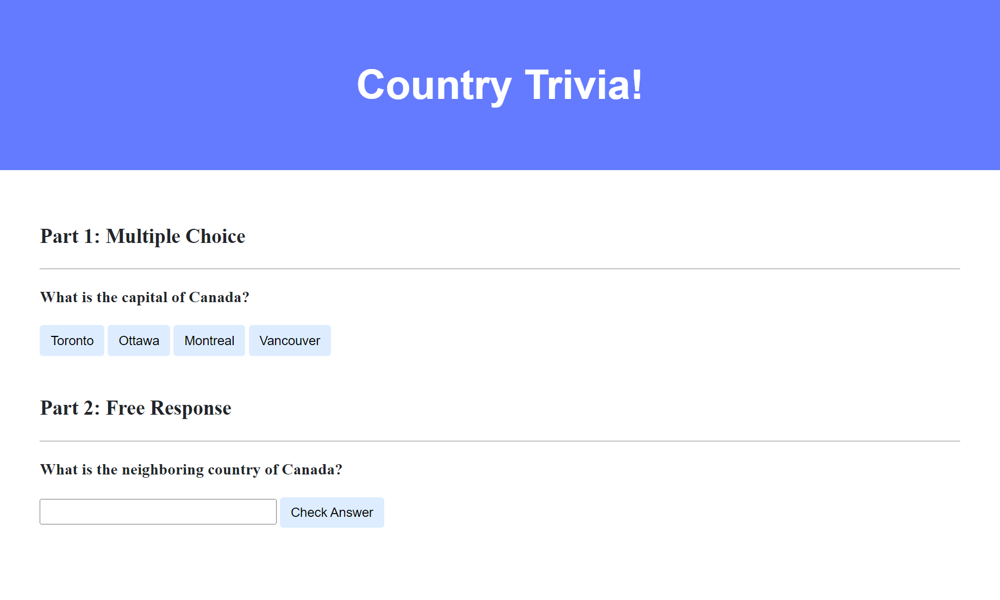

# Trivia

## Getting Started

1. On GitHub Desktop, make sure your current repository is `OIM3600`. Then click `Repository` -> `Open in Visual Studio Code` to open the folder in your **VS Code**.
2. Inside `hw` folder, create a new folder `trivia`. Within the `trivia` folder, create a new file, `trivia.html`. Copy the code from [`index.html`](./trivia/index.html) on GitHub, and paste to the `trivia.html` file you create in VS Code.
3. Within the `trivia` folder, create a new folder `css`. Within `css` folder, create a new file, `styles.css`. Copy the code from [`styles.css`](./trivia/css/styles.css) on GitHub, and paste to the `styles.css` file you create in VS Code.

## Goal

Create a webpage that lets users answer trivia questions.

## Implementation Details

Design a webpage using HTML, CSS, and JavaScript to let users answer trivia questions.

- In `index.html`, add beneath "Part 1" a multiple-choice trivia question of your choosing with HTML.
  - You should use an `h3` heading for the text of your question.
  - You should have one button for each of the possible answer choices. There should be at least three answer choices, of which exactly one should be correct.
- Using JavaScript, add logic so that the buttons change colors when a user clicks on them.
  - If a user clicks on a button with an incorrect answer, the button should turn red and text should appear beneath the question that says "Incorrect".
  - If a user clicks on a button with the correct answer, the button should turn green and text should appear beneath the question that says "Correct!".
- In `index.html`, add beneath "Part 2" a text-based free response question of your choosing with HTML.
  - You should use an `h3` heading for the text of your question.
  - You should use an `input` field to let the user type a response.
  - You should use a button to let the user confirm their answer.
- Using JavaScript, add logic so that the text field changes color when a user confirms their answer.
  - If the user types an incorrect answer and presses the confirmation button, the text field should turn red and text should appear beneath the question that says "Incorrect".
  - If the user types the correct answer and presses the confirmation button, the input field should turn green and text should appear beneath the question that says "Correct!".

## Hints

- Use `document.querySelector` to query for a single HTML element.
- Use `document.querySelectorAll` to query for multiple HTML elements that match a query. The function returns an array of all matching elements.

## Optional Tasks

- Edit `css/styles.css` to change the CSS of your webpage!
- Add additional trivia questions to your trivia quiz if you would like!
- Use [REST Countries API](https://restcountries.com/) to generate random trivia questions dynamically.

## How to Submit

- Save all the files opened in VS Code. Format your code before saving.
- **Commit** and **Push to Origin** in GitHub Desktop. Check repository on GitHub.com to make sure all the commits are successfully pushed to remote.
